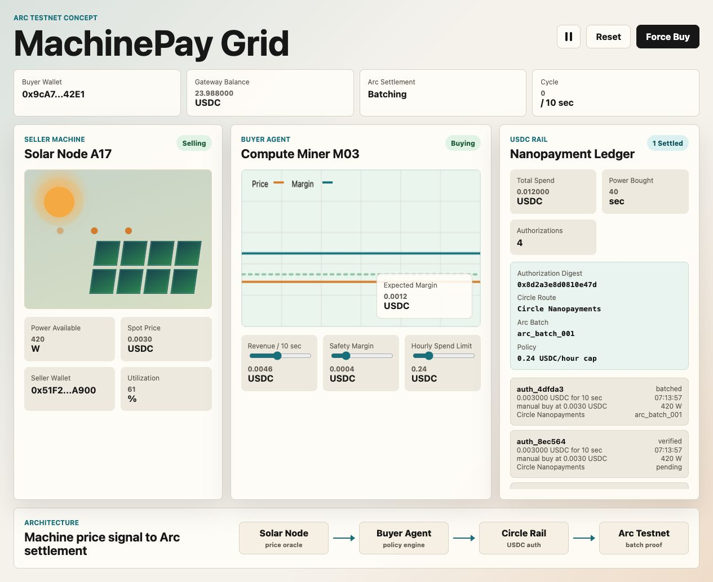

# MachinePay Grid

MachinePay Grid is a pitch-ready MVP for Arc builder events and the Circle Grants application.

It demonstrates an autonomous machine-commerce loop:

1. A simulated solar node broadcasts a changing electricity price.
2. A compute/miner agent evaluates whether buying power is profitable.
3. If profitable, the agent creates a USDC-style payment authorization.
4. The ledger tracks verified and batched settlement states for Arc and Circle.



## Open the demo

Live demo: https://gnanam1990.github.io/machinepay-grid/

Run a local static server from this folder:

```bash
python3 -m http.server 4173
```

Then open `http://127.0.0.1:4173/`.

## Grant framing

MachinePay Grid lets autonomous machines and AI agents buy electricity, compute, data, and services using USDC nanopayments, with Arc as the stablecoin-native settlement layer.

The same project can be framed two ways:

- Arc Builder Spotlight: machine-to-machine nanopayments on Arc, shown through a solar node selling electricity to an autonomous buyer agent.
- Circle Questbook: a USDC agent-commerce network using Circle wallets, Gateway/Nanopayments, and Arc Testnet settlement.

## Submission package

- GitHub repository: https://github.com/gnanam1990/machinepay-grid
- Live demo: https://gnanam1990.github.io/machinepay-grid/
- Demo video: https://gnanam1990.github.io/machinepay-grid/docs/assets/video/machinepay-grid-demo.mp4
- [Proposal](docs/proposal.md)
- [Demo video script](docs/demo-video-script.md)
- [Submission checklist and form copy](docs/submission.md)

## Next integration milestones

- Replace mock authorizations with Circle Agent Wallet and Gateway/Nanopayments calls.
- Add Arc Testnet transaction proofs and ArcScan links.
- Add machine identity, spend limits, and policy controls.
- Add second marketplace resource type: compute or API data.
